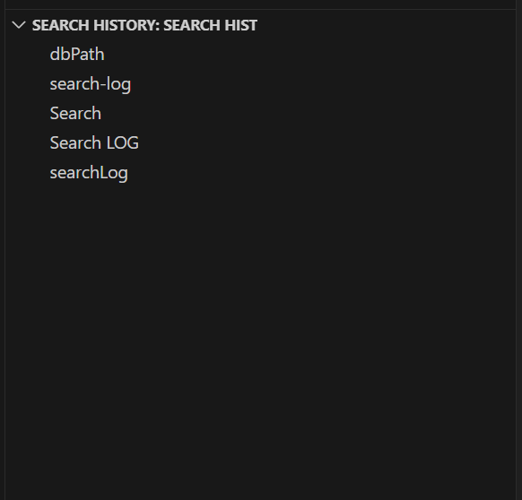

A simple extension that show search history in sidebar.

Click item in list to copy to clipboard.

Need to manually refresh view after 5~10 second now. 

It works by reading 'workbench.search.history' in state.db. 

